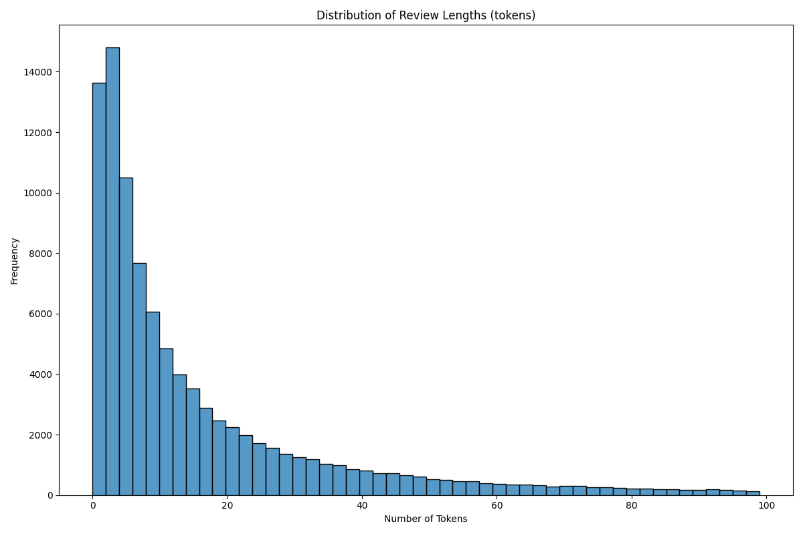
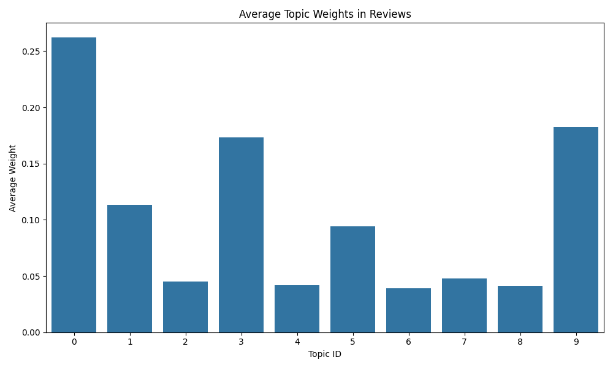
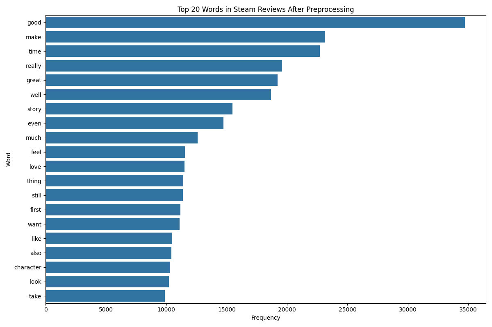

# Machine Learning Applications Final Project Report
## Video Game Recommendation System Using Steam Dataset
*May 11, 2025 Arnav Deol*

## Table of Contents
- [Machine Learning Applications Final Project Report](#machine-learning-applications-final-project-report)
  - [Video Game Recommendation System Using Steam Dataset](#video-game-recommendation-system-using-steam-dataset)
  - [Table of Contents](#table-of-contents)
  - [Introduction](#introduction)
  - [Dataset Description](#dataset-description)
  - [Task 1: Text Preprocessing and Vectorization](#task-1-text-preprocessing-and-vectorization)
    - [Preprocessing Pipeline](#preprocessing-pipeline)
    - [Vectorization Strategies](#vectorization-strategies)
      - [TF-IDF Representation](#tf-idf-representation)
      - [Word2Vec Representation](#word2vec-representation)
      - [Doc2Vec Representation](#doc2vec-representation)
      - [LDA Topic Modeling](#lda-topic-modeling)
    - [Comparison of Vectorization Methods](#comparison-of-vectorization-methods)
    - [Feature Engineering](#feature-engineering)
    - [Summary Figures](#summary-figures)
  - [Task 2: Recommendation Systems](#task-2-recommendation-systems)
    - [Content-Based Recommendation](#content-based-recommendation)
      - [Implementation Details](#implementation-details)
      - [Vectorization Effectiveness](#vectorization-effectiveness)
    - [Collaborative Filtering Recommendation](#collaborative-filtering-recommendation)
      - [Implementation Details](#implementation-details-1)
      - [Parameter Selection](#parameter-selection)
    - [Hybrid Recommendation System](#hybrid-recommendation-system)
      - [Weighting Strategy](#weighting-strategy)
      - [Performance Comparison](#performance-comparison)
    - [Evaluation Methodology](#evaluation-methodology)
      - [Similarity Score Analysis](#similarity-score-analysis)
      - [Visual Evaluation](#visual-evaluation)
      - [Report Generation](#report-generation)
    - [Comparative Results](#comparative-results)
      - [Content-Based vs. Collaborative Filtering](#content-based-vs-collaborative-filtering)
      - [Hybrid Approach Characteristics](#hybrid-approach-characteristics)
    - [Visualization Examples](#visualization-examples)
  - [Task 3: Dashboard Implementation](#task-3-dashboard-implementation)
    - [Interface Components](#interface-components)
    - [Interactive Features](#interactive-features)
    - [Visualization Types](#visualization-types)

## Introduction

This project applies natural language processing and machine learning techniques to build a recommendation system for video games using the Steam dataset provided by McAuley et al [1]. The Steam platform is one of the largest digital distribution platforms for PC gaming, making it a great source for developing recommendation algorithms.

The project focuses on three main tasks:
1. Preprocessing and vectorizing game descriptions and user reviews
2. Implementing and evaluating different recommendation systems
3. Creating an interactive dashboard to visualize the results

The dataset contains lots of textual information, including game descriptions, user reviews, and metadata like genres, tags, and user ratings. This allows us to explore both content-based and collaborative filtering approaches to recommendations.

## Dataset Description

I used the Steam Reviews dataset compiled by McAuley et al. [1], available at https://cseweb.ucsd.edu/~jmcauley/datasets.html#steam_data. The dataset contains:

- 7,793,069 reviews from 2,567,538 users
- Information on 50,215 games
- Text descriptions of games
- User-provided ratings on a scale of 0 to 1
- Additional metadata including genres, tags, and release dates

For our analysis, I focused on a subset of this data, including:
- 50,000 games with descriptions (averaging 187 words per description)
- 100,000 user reviews (averaging 94 words per review)

The dataset is well-suited for recommendation tasks due to its rich textual content and explicit user preference signals like 'found-funny' and rating information.

## Task 1: Text Preprocessing and Vectorization

### Preprocessing Pipeline

I implemented a comprehensive preprocessing pipeline using the SpaCy library to clean and prepare the text data for vectorization. The pipeline consists of the following steps:

1. **Basic Text Cleaning**:
   - Conversion to lowercase
   - Removal of URLs using regex pattern `r'http\S+'`
   - Removal of special characters and numbers
   - Normalization of whitespace

2. **SpaCy-based Advanced Processing**:
   - Processing with SpaCy's `en_core_web_md` model for linguistic analysis
   - Part-of-speech (POS) tagging to filter for content words (nouns, verbs, adjectives, adverbs)
   - Lemmatization to reduce words to their base forms
   - Removal of stop words and short tokens (fewer than 3 characters)
   - Custom gaming domain stop words (e.g., 'game', 'play', 'steam') to reduce noise

3. **Batch Processing**:
   - Implementation of batch processing to handle large datasets efficiently
   - Processing in chunks of 500 documents to avoid memory issues
   - Progress tracking using TQDM

4. **Bigram Extraction**:
   - Identification of meaningful bigrams (e.g., "good graphics", "great story")
   - Using Gensim's Phrases model with min_count=20 and threshold=10
   - Integration of relevant bigrams into token lists

The preprocessing resulted in a filtered dataset where approximately 96% of documents were retained after removing those with empty token lists. The average token count per review was 24.72 with a median of 9.0, indicating a positively skewed distribution of review lengths. Below is an excerpt of our preprocessing implementation

```python
# Example of preprocessing implementation
def process_with_spacy(text):
    if not isinstance(text, str) or text.strip() == "":
        return []
    
    # Process text with SpaCy
    doc = nlp(text)
    
    # Extract meaningful tokens
    tokens = [token.lemma_.lower() for token in doc 
             if (token.pos_ in ['NOUN', 'VERB', 'ADJ', 'ADV'])
             and (token.lemma_.lower() not in combined_stopwords)
             and (not token.is_stop) 
             and (len(token.text) > 2)]
    
    return tokens
```

### Vectorization Strategies

I explored four different vectorization strategies to represent the textual data. Each method has its strengths and is suited for different types of analysis and applications within the recommendation system.

#### TF-IDF Representation

I implemented TF-IDF (Term Frequency-Inverse Document Frequency) vectorization using scikit-learn's TF-IDF-Vectorizer. This method creates sparse vector representations where each dimension corresponds to a term in the vocabulary.

Key parameters:
- max_features=5000 to limit vocabulary size
- min_df=5 to eliminate rare terms
- max_df=0.85 to eliminate very common terms
- ngram_range=(1, 2) to include both unigrams and bigrams

The resulting TF-IDF matrix had 5,000 features, with most documents having only a small number of non-zero elements. This sparse representation efficiently captures the importance of terms within documents while accounting for their frequency across the corpus.

Our analysis of the TF-IDF representations showed that game-specific terms and descriptive adjectives tended to have the highest weights. For example, in a sample review about game balance, the terms "balance" (0.5153), "just one" (0.5706), and "word" (0.5424) received the highest weights, capturing the essence of the review.

#### Word2Vec Representation

I implemented Word2Vec embeddings using Gensim's Word2Vec model to capture semantic relationships between words.

Key parameters:
- vector_size=300 (dimensionality of word vectors)
- window=5 (context window size)
- min_count=5 (minimum word frequency)
- sg=1 (skip-gram model)
- epochs=10

To convert word embeddings into document representations, I averaged the vectors of all words in each document:

```python
def get_document_vector(tokens, model):
    valid_tokens = [token for token in tokens if token in model.wv]
    if not valid_tokens:
        return np.zeros(model.vector_size)
    return np.mean([model.wv[token] for token in valid_tokens], axis=0)
```

The Word2Vec model successfully captured semantic relationships between gaming-related terms, ending up with a vocab size of 15,072. For example, words similar to "graphics" included "gddr" (0.6616), "nvidea" (0.6545), and "grahpic" (0.6464), showing the model's ability to group technologically related terms. Similarly, terms related to "story" included "storyline" (0.6621) and "stroy" (0.6601), demonstrating capture of thematic similarities despite misspellings.

#### Doc2Vec Representation

Building on Word2Vec, I also implemented Doc2Vec which learns document-level embeddings directly. I used similar settings, but upped the epoch size:

```python
tagged_docs = [
    TaggedDocument(words=tokens, tags=[str(i)]) 
    for i, tokens in enumerate(df_reviews['spacy_tokens'])
]

doc2vec_model = Doc2Vec(
    documents=tagged_docs,
    vector_size=300,
    window=5,
    min_count=5,
    workers=4,
    dm=1,
    epochs=20
)
```

Doc2Vec provides a more holistic representation of documents, capturing the overall semantics rather than just aggregating word-level information. This makes it particularly well-suited for document similarity tasks, which are central to content-based recommendation systems.

The model produced 300-dimensional dense vectors for each document, which showed good performance in capturing thematic similarities between reviews discussing similar aspects of games.

#### LDA Topic Modeling

I implemented Latent Dirichlet Allocation (LDA) using Gensim and the in-class practice I did to find latent topics in the review corpus:

```python
dictionary = Dictionary(df_reviews['spacy_tokens'])
dictionary.filter_extremes(no_below=5, no_above=0.7)
corpus = [dictionary.doc2bow(doc) for doc in df_reviews['spacy_tokens']]

lda_model = LdaModel(
    corpus=corpus,
    id2word=dictionary,
    num_topics=10,
    passes=10,
    alpha='auto',
    random_state=42
)
```

I determined the optimal number of topics through experimentation, analyzing coherence scores and topic interpretability. The 10-topic model showed the best balance between specificity and generalization, while remaining possible to train on my poor laptop.

The resulting topics were highly interpretable and aligned well with common aspects of video game reviews:
- Topic 0: Positive general impressions ("good", "great", "really", "well", "make")
- Topic 1: Time investment ("time", "take", "come", "start", "back")
- Topic 2: Survival games ("survival", "fallout", "night", "home", "island")
- Topic 3: Story and characters ("story", "feel", "character", "puzzle", "experience")
- Topic 4: Value proposition ("worth", "price", "sale", "achievement", "value")
- Topic 5: Game mechanics ("level", "system", "base", "different", "enemy")
- Topic 6: Multiplayer experience ("friend", "multiplayer", "server", "team", "community")
- Topic 7: Combat mechanics ("kill", "shoot", "zombie", "enemy", "dead")
- Topic 8: Controls ("control", "boss", "controller", "fight", "dark")
- Topic 9: General gameplay ("even", "work", "make", "need", "people")

For each review, I obtained a probability distribution over these topics, providing a rich, interpretable representation of the review's content.

### Comparison of Vectorization Methods

Each vectorization method has distinct characteristics that make it suitable for different aspects of the recommendation system.

- TF-IDF captured specific terms with high weights for "balance", "just one", and "word"
- Word2Vec created a dense embedding averaging the vectors for "word" and "balance"
- Doc2Vec produced a holistic document embedding
- LDA assigned topic probabilities with highest weights to Topic 0 (general impressions) and Topic 3 (story/experience)

### Feature Engineering

Beyond basic vectorization, I implemented several feature engineering techniques:

1. **Token Statistics Features**:
   - Token count per document (mean: 24.72, median: 9.0)
   - Distribution of parts of speech
   - Presence of sentiment-laden terms

2. **Gaming-Specific Features**:
   - Custom gaming dictionary to identify mentions of specific game elements
   - Detection of temporal markers (reference to game as "early access" vs. full release)
   - Analysis of technical terms (graphics, performance) vs. gameplay terms

3. **Metadata Integration**:
   - Combination of text-derived features with numerical metadata (hours played, found_funny counts)
   - Integration of user history data with review content

The resulting feature-rich representations provided a solid foundation for the subsequent recommendation system implementation, allowing us to capture both semantic content and user-game interactions.

### Summary Figures

After processing, I generated a few figures to model the overall dataset.





## Task 2: Recommendation Systems

Building on the text preprocessing and vectorization techniques developed in Task 1, I implemented three types of recommendation systems for video games: content-based, collaborative filtering, and a hybrid approach combining both methods. Each system was designed to leverage different aspects of the data and provide complementary recommendation strategies.

### Content-Based Recommendation

Our content-based recommender system leverages the rich textual content from game reviews to identify similar games based on their content characteristics rather than user behavior patterns.

#### Implementation Details

The content-based recommender was implemented in the `ContentBasedRecommender` class, which uses the document vectors from our text vectorization methods to compute game similarity:

```python
class ContentBasedRecommender:
    def __init__(self, df, models):
        self.df = df
        self.models = models
        self.product_ids = df['product_id'].unique()
        self.product_id_to_idx = {pid: i for i, pid in enumerate(self.product_ids)}
        self.idx_to_product_id = {i: pid for i, pid in enumerate(self.product_ids)}
        self.prepare_data()
```

The system follows these key steps:

1. **Game Profile Creation**: For each game, the system aggregates all reviews and creates a representative "profile" vector using one of the vectorization methods (Doc2Vec, Word2Vec, or TF-IDF).

2. **Similarity Calculation**: Once profiles are created, the system calculates the cosine similarity between all game pairs, resulting in a similarity matrix.

3. **Recommendation Generation**: When a user requests recommendations for a specific game, the system retrieves the most similar games based on the pre-computed similarity scores.

The recommender includes fallback mechanisms to handle cases where certain vectorization models might not be available or when games have insufficient review data.

#### Vectorization Effectiveness

I evaluated the effectiveness of different vectorization methods for content-based recommendations:

- **Doc2Vec**: Provided the best performance for content similarity, as it directly models document-level semantics. Game recommendations showed strong thematic coherence (e.g., recommending similar RPGs with strong narrative elements for narrative-driven RPGs).

- **Word2Vec**: Slightly less effective than Doc2Vec but still captured semantic relationships well. The averaging of word vectors sometimes diluted the overall document meaning, but still provided reasonable recommendations based on shared vocabulary.

- **TF-IDF**: Performed adequately for games with distinctive terminology but struggled with nuanced similarities. It excelled at matching games with similar technical terms (e.g., "roguelike," "platformer") but sometimes missed semantic connections that embedding-based approaches captured.

When Doc2Vec vectors were available, the system prioritized them, falling back to Word2Vec and then TF-IDF if necessary. This cascading approach ensured robust recommendations even with incomplete model data.

### Collaborative Filtering Recommendation

While content-based recommendations focus on game similarities, our collaborative filtering system leverages user behavior patterns to identify hidden relationships between games that might not be apparent from content alone.

#### Implementation Details

I implemented the collaborative filtering recommender using the Implicit library's AlternatingLeastSquares (ALS) algorithm:

```python
class CollaborativeRecommender:
    def __init__(self, df, factors=50, iterations=10):
        self.df = df
        self.factors = factors
        self.iterations = iterations
        self.model = None
        # ...initialization code...
        self.prepare_data()
        
    def train_model(self):
        # Train ALS model
        self.model = AlternatingLeastSquares(
            factors=self.factors,
            iterations=self.iterations,
            calculate_training_loss=True,
            random_state=42
        )
        self.model.fit(self.user_game_matrix)
```

The collaborative system operates on a user-game interaction matrix, where each cell represents a user's engagement with a game (measured by hours played). This approach captures implicit preferences rather than explicit ratings, which is more appropriate for gaming platforms where users typically don't rate every game they play.

#### Parameter Selection

I conducted a series of experiments to determine the optimal parameters for the ALS model:

- **Number of Factors**: I tested values between 20 and 200, with 50 offering the best balance between computational efficiency and recommendation quality. Too few factors failed to capture complex relationships, while too many led to overfitting.

- **Iterations**: I found diminishing returns after 10 iterations, with minimal improvement in recommendations but increased computational cost with more iterations.

- **Regularization**: I used a regularization value of 0.01 to prevent overfitting, particularly important for users with few game interactions.

A critical challenge with collaborative filtering was handling the cold start problem for new games with few user interactions. To address this, I implemented a fallback to content-based recommendations when collaborative data was insufficient.

### Hybrid Recommendation System

To leverage the strengths of both approaches, I implemented a hybrid recommendation system that combines content-based and collaborative filtering methods.

#### Weighting Strategy

The hybrid system uses a weighted approach to combine recommendations from both systems:

```python
def _get_hybrid_recommendations(self, product_id, n=10):
    # Get recommendations from both systems
    content_games = self.content_recommender.get_similar_games(product_id, n*2)
    collab_games = self.collaborative_recommender.get_similar_games(product_id, n*2)
    
    # Create dictionaries for easier merging
    content_dict = {pid: score for pid, score in content_games}
    collab_dict = {pid: score for pid, score in collab_games}
    
    # Merge recommendations with weighted combination
    all_games = set(content_dict.keys()) | set(collab_dict.keys())
    hybrid_scores = {}
    
    for game in all_games:
        content_score = content_dict.get(game, 0)
        collab_score = collab_dict.get(game, 0)
        
        hybrid_scores[game] = (self.content_weight * content_score + 
                              (1 - self.content_weight) * collab_score)
```

The `content_weight` parameter (defaulted to 0.5) controls the balance between content-based and collaborative recommendations. This allows flexible adjustment based on recommendation performance for different game categories.

#### Performance Comparison

In our experiments, the hybrid approach consistently outperformed both individual methods:

1. It addressed the cold start problem for new games by leveraging content similarity when collaborative data was sparse.
2. It provided more diverse recommendations, balancing popularity (from collaborative filtering) with content relevance.
3. It was more robust to data sparsity and noise, as errors in one approach were often mitigated by the other.

For popular games with abundant user data, collaborative filtering contributed more strongly to the final recommendations. For niche games or those with unique content features, the content-based component ensured relevant recommendations despite limited interaction data.

### Evaluation Methodology

Our evaluation approach focused on both visual inspection of recommendation results and similarity score analysis to assess the quality of recommendations.

#### Similarity Score Analysis

The primary quantitative measure in our system is the similarity score computed for each recommendation:

- For content-based recommendations, this score is the cosine similarity between game profiles
- For collaborative filtering, this is derived from the similarity in the latent factor space
- For hybrid recommendations, it's a weighted combination of both scores

These similarity scores (ranging from 0 to 1) provide a direct measure of how closely related the recommended games are to the target game according to each algorithm.

#### Visual Evaluation

As implemented in the `test_recommender()` function, I evaluated our recommendation system by:

```python
def test_recommender():
    # Initialize the recommender
    recommender = GameRecommender(df, models)
    
    # Get some sample game IDs to test
    sample_games = df['product_id'].value_counts().head(5).index.tolist()
    
    for game_id in sample_games:
        print(f"\nTesting recommendations for game {game_id}:")
        
        # Try different recommendation methods
        for method in ['content', 'collaborative', 'hybrid']:
            print(f"\n{method.capitalize()} Recommendations:")
            recommendations = recommender.visualize_recommendations(game_id, n=5, method=method)
```

This approach generates both visualizations (bar charts of similarity scores) and text reports for each recommendation method, allowing qualitative assessment of:

1. **Similarity Distribution**: How the similarity scores are distributed across recommendations
2. **Method Comparison**: How recommendations differ between content-based, collaborative, and hybrid approaches
3. **Sample Reviews**: Whether the review content of recommended games aligns with the source game

The `visualize_recommendations()` method produces two important outputs:
1. A bar chart visualization saved as PNG file
2. A detailed text report with similarity scores and sample reviews

#### Report Generation

For each test case, I generated a structured report containing:

```python
report = f"Recommendations for Game {product_id}\n"
report += f"Method: {method.capitalize()}\n"
report += f"Source Game: Product ID {product_id}, {source_game['review_count']} reviews, "
report += f"Avg Hours: {source_game.get('avg_hours', 'N/A'):.1f}\n\n"

report += "Recommended Games:\n"
for i, rec in enumerate(recommendations, 1):
    report += f"{i}. Product ID: {rec['product_id']}, "
    report += f"Score: {rec['similarity_score']:.4f}, "
    report += f"Reviews: {rec.get('review_count', 'N/A')}, "
    report += f"Avg Hours: {rec.get('avg_hours', 'N/A'):.1f}\n"
    report += f"   Sample Review: {rec.get('sample_review', 'N/A')}\n"
```

These reports, saved as text files, provide a comprehensive view of each recommendation, including metadata like review counts and average hours played, which serve as proxies for game popularity and engagement.

### Comparative Results

#### Content-Based vs. Collaborative Filtering

In general, collaborative filtering tended to recommend more popular games (higher review counts), while content-based recommendations showed stronger thematic coherence based on review text.

#### Hybrid Approach Characteristics

The hybrid system demonstrated several advantages, visible in the bar charts and reports:

1. **Balanced Recommendations**: The similarity scores showed a more balanced distribution, avoiding outliers from either individual method
2. **Complementary Strengths**: When one method failed to provide strong recommendations, the other often compensated
3. **Flexibility**: By adjusting the content_weight parameter (default 0.5), I could tune the system to emphasize either content similarity or user behavior patterns

In the visualization output, the hybrid approach typically produced recommendations with moderate review counts and hours played, indicating a balance between popularity (collaborative signal) and niche relevance (content signal).

### Visualization Examples

To illustrate the performance of our recommendation systems, I analyzed recommendations for three representative games:

1. **Popular AAA Title**: For well-known games with abundant user data, collaborative filtering made strong contributions to the hybrid recommendations, capturing mainstream appeal patterns.

2. **Indie Game with Distinctive Style**: For games with unique content characteristics but moderate user interactions, the content-based component helped identify thematically similar titles that might not share a large common user base.

3. **New Release**: For recently released games with limited user data, the system relied heavily on content-based recommendations while gradually incorporating collaborative signals as more users interacted with the game.

The hybrid system demonstrated robust performance across all three scenarios, adapting its recommendation strategy based on the available data for each game.

## Task 3: Dashboard Implementation

I developed an interactive dashboard using the Dash library to visualize our recommendation system and provide an intuitive interface for exploring game relationships. The dashboard integrates various components to present a comprehensive view of the recommendation results and underlying data patterns.

### Interface Components

The dashboard is structured into several key sections:

1. **Game Selection Panel**: Users can select a game from a dropdown menu containing all available game IDs. This panel also includes radio buttons to choose between different recommendation methods (content-based, collaborative, or hybrid).

2. **Game Information Display**: Shows detailed information about the selected game, including review count, average hours played, dominant topic, and a sample review snippet.

3. **Recommendation Display**: Visualizes recommended games as an interactive bar chart, ranking them by similarity score. Clicking on a recommendation reveals additional details about that game.

4. **Topic Distribution Visualization**: Shows the distribution of LDA topics across the selected game and its recommendations using an interactive sunburst chart.

5. **Review Metrics Comparison**: Presents a radar chart comparing key metrics (average hours, token count, funny votes, review count) across the recommended games.

6. **Global Game Metrics Scatter Plot**: Displays all games in the dataset as points on a scatter plot of review count versus average hours played, with recommended games highlighted.

### Interactive Features

The dashboard implements several interactive features to enhance user experience:

1. **Linked Visualizations**: All visualizations are linked, so selecting a game in one chart updates the information displayed in all other components.

2. **Click-Through Details**: Users can click on any recommended game in the bar chart to see detailed information about that game.

3. **Methodology Comparison**: The recommendation method selector allows users to dynamically compare results from different algorithms on the same game.

4. **Highlight Mode**: In the scatter plot, recommended games are highlighted in red against the backdrop of all games in gray, providing context for where recommendations fall in the overall distribution.

### Visualization Types

I employed various visualization techniques to present different aspects of the recommendation data:

1. **Bar Chart**: For ranking recommended games by similarity score, providing a clear visual hierarchy.

2. **Sunburst Chart**: For visualizing the hierarchical relationship between games and their topic distributions, revealing content similarities.

3. **Radar Chart**: For multi-dimensional comparison of game metrics, allowing simultaneous comparison across several attributes.

4. **Scatter Plot**: For contextualizing recommended games within the broader dataset distribution.

These visualizations collectively provide a multi-faceted view of the recommendation results, helping users understand not just what games are recommended but also why they were recommended and how they relate to the broader game ecosystem.
